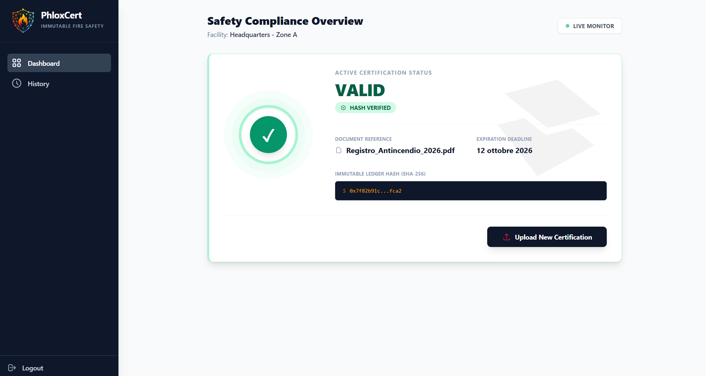

# 🚀 PhloxCert

**Immutable Fire Safety Compliance & Digital Identity powered by IOTA.**

## 📖 Overview

### The Use-Case: Systemic Failure in Fire Safety
The tragedy of **Crans-Montana** was not just an accident; it was a symptom of a structural collapse in monitoring processes. Investigations revealed that the site had not undergone a safety inspection in over **5 years**, leading to blocked exits and non-functional extinguishers during a disaster that claimed 40 lives. This stems from a fundamental problem: **Opacity and manipulability of safety data.**

Traditional paper trails or local databases are easily altered, allowing negligence and bureaucratic expiration to pass unnoticed until disaster strikes. PhloxCert addresses this by turning safety into an **Immutable Black Box**.

*   **Common**: Passive inspections and superficial maintenance affect millions of public venues globally.
*   **In Crescendo**: Increasing legal liabilities (compliance) and demands for transparency from insurance and tourism sectors.
*   **Urgent**: Disasters like Crans-Montana demonstrate that safety is a "here and now" requirement.
*   **Mandatory**: Fire safety is governed by strict laws, yet enforcement mechanisms are often non-existent or ignored.
*   **Frequent**: Safety checks are operational necessities that occur daily or monthly, making manual processes inefficient and prone to human error.

### The Solution: The "Black Box" of Building Safety
PhloxCert leverages the **IOTA Protocol** to provide an unalterable "Architecture of Trust". By decentralizing inspection records, we ensure that:
- **Negligence cannot be hidden**: Every check (or lack thereof) is recorded on the Tangle.
- **Real-time Awareness**: Consumers can verify a venue's safety status instantly via QR codes.
- **Enforcement through Transparency**: Moving from "check-the-box" compliance to a verifiable, immutable audit trail.

---

## ✨ Key Features
* **🔐 Wallet-Based Authentication**: Secure access for inspectors and operators using IOTA DIDs.
* **📦 Digital Twin Tokenization (NFTs)**: Every safety device (extinguisher, alarm) is treated as a unique digital asset on-chain to prevent "generic" inspections.
* **🛡️ Locked Notarizations**: Unalterable proof-of-inspection with SHA256 integrity hashes, preventing backdating or deletion.
* **📊 Dual-Identity Attribution**: Independent tracking for both the **Uploader** (inspector) and the **Activity Subject** (establishment).
* **📱 Public Verification Portal**: A dynamic `/landing/did:iota:address` interface for consumers to instantly verify a venue's safety status and audit the latest 3 documents—**no wallet required for verification.**

---

## ⛓️ Use of IOTA Technology
IOTA was chosen for its ability to handle micro-data transactions (frequent notarizations) with high scalability and minimal costs.

* **IOTA Move Smart Contracts**: Manages the **User Registry** and coordinates the lifecycle of notarization objects.
* **IOTA Identity (DIDs)**: Every user and establishment is identified via a Decentralized Identifier, ensuring sovereign ownership of compliance history.
* **Locked Notarizations**: Provides a cryptographic link between digital records and physical safety checks, acting as the "Black Box" data logger.

---

## 🏗 System Architecture

### High-Level Design
PhloxCert consists of a **Vite/React frontend** for user interaction, an **Express/TypeScript backend** for secure transaction signing (`PRIVATE_KEY` management), and **IOTA Move contracts** as the final arbiter of truth.

```text
  ┌──────────────┐       ┌──────────────┐       ┌──────────────┐
  │  FRONTEND    │       │   BACKEND    │       │  IOTA LEDGER │
  │ (React App)  │       │ (Express TS) │       │ (Move Chain) │
  └──────┬───────┘       └──────┬───────┘       └──────┬───────┘
         │  1. Upload Meta      │                      │
         ├─────────────────────►│  2. Sign & Notarize  │
         │                      │◄────────────────────►│
         │  3. Verify & Index   │                      │
         │◄─────────────────────┤                      │
```

### Technical Stack
* **Languages**: Move (On-chain logic), TypeScript (Backend), JavaScript (Frontend)
* **Frameworks**: React, Vite, Express, TailwindCSS
* **IOTA SDKs**: `@iota/iota-sdk`, `@iota/dapp-kit`, `@iota/identity-wasm`

---

## 🎬 Media


*Visualize your digital assets and compliance status in real-time.*

---

## 🛠 Step-by-Step Development Guide

Follow this precise sequence to deploy the full PhloxCert ecosystem from scratch.

### 1. IOTA Environment Setup
Before deploying code, ensure your local environment is ready:
- **Wallet**: Install the [IOTA Wallet Extension](https://chromewebstore.google.com/detail/iota-wallet/iidjkmdceolghepehaaddojmnjnkkija) and set it to **Custom** (node URL: `http://localhost:9000`) for the localHost or the network that you are using.
- **Faucet**: Fund your addresses for gas:
  ```bash
  iota client faucet --address <YOUR_WALLET_ADDRESS>
  ```
- **Server Identity**: Generate a dedicated address for the backend and fund it:
  ```bash
  iota client new-address
  iota client switch --address <SERVER-ADDR>
  iota client faucet #fund the address
  iota keytool export <SERVER-ADDR>  # Extract the iotaprivkey...
  ```

### 2. Registry Smart Contracts
The foundation of the system is the User Registry.
1. **Clone**: `git clone https://github.com/PhloxCert/phloxCert_movePackages.git`
2. **Build & Publish**:
   ```bash
   cd phloxCert_movePackages/register_contract
   iota move build
   iota client publish --gas-budget 20000000
   ```
3. **Capture IDs**: Note the **PackageID** and the **Registry ObjectID** from the output. These are required for all subsequent components.

### 3. Notarization Infrastructure
The core notarization logic is provided by the official IOTA notarization repo.
1. **Clone**: `git clone https://github.com/iotaledger/notarization.git`
2. **Publish**:
   ```bash
   cd notarization
   bash ./notarization-move/scripts/publish_package.sh
   ```
3. **Capture ID**: Note the **NOTARIZATION_PACKAGE_ID** from the script output.

### 4. Backend Deployment
The bridge between the blockchain and the frontend.
1. **Clone**: `git clone https://github.com/PhloxCert/phloxCert_backend.git`
2. **Configure**:
   ```bash
   cd phloxCert_backend
   cp .env.example .env
   ```
   Then edit `.env` and set:
- `PORT` → API port (default `8080`)
- `IOTA_NODE_URL` → the IOTA node (e.g. `http://127.0.0.1:14265` or `http://localhost:9000`)
- `PACKAGE_ID` → deployed Registry Move package ID
- `REGISTRY_ID` → deployed registry object ID
- `NOTARIZATION_PACKAGE_ID` → deployed notarization-move package ID
- `PRIVATE_KEY` → A valid Ed25519 secret key for the server to spawn and sign Notarization transactions.

3. **Run**:
   ```bash
   npm install
   npm run dev
   ```

### 5. Frontend UI
The final user-facing layer.
1. **Clone**: `git clone https://github.com/PhloxCert/phloxCert_frontend.git`
2. **Configure**:
   ```bash
   cd phloxCert_frontend
   cp .env.example .env
   ```
   Then edit `.env` and set:
    - `VITE_API_BASE_URL` → backend API URL (e.g. `http://localhost:8080`)
    - `VITE_IOTA_NODE_URL` → local IOTA node (e.g. `http://127.0.0.1:9000`)
    - `VITE_PACKAGE_ID` / `VITE_REGISTRY_ID` → the deployed registry contract
  
4. **Run**:
   ```bash
   npm install
   npm run dev
   ```

---

## 👥 The Team
- [PhloxCert Devs](https://github.com/orgs/PhloxCert/teams/phloxcertdevs)
